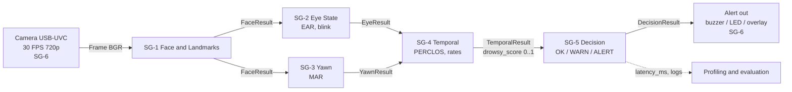
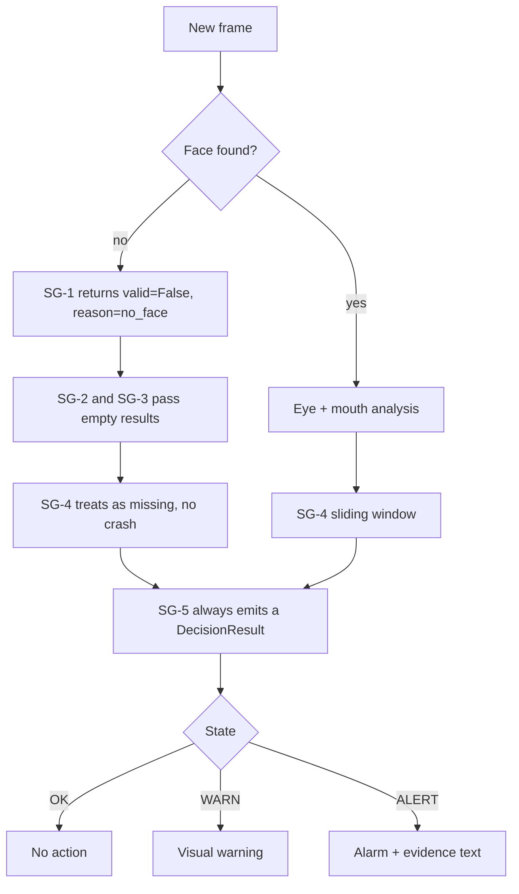
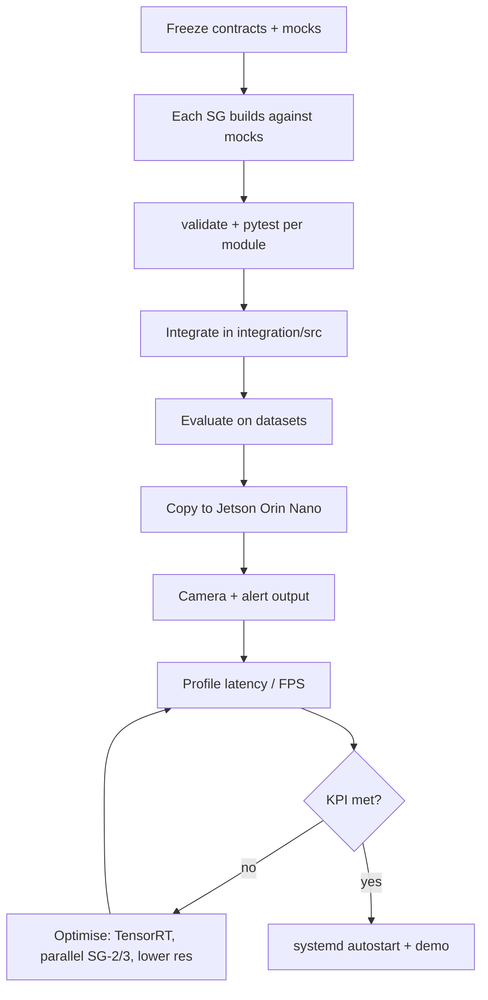

# 3 - Process Flow Map

Covers [[1 - Pipeline SG-1 to SG-5]] and [[2 - Jetson SG-6 Deploy]]. Index: [[Driver Drowsiness Index]].

## Runtime data flow (per frame)

## Per-frame failure handling

## Build and deploy flow

## Reading the map
1. Camera pushes a `Frame` by reference; nothing is serialised in the hot path.
2. SG-1 is the only module that touches pixels; SG-2/3 use landmarks and ROIs.
3. SG-2 and SG-3 are independent and can run in parallel.
4. SG-4 turns frame cues into window behaviour; SG-5 turns the score into a state.
5. Every arrow carries a contract object that always exists (`valid` + `reason`), so the chain never breaks on missing data.
