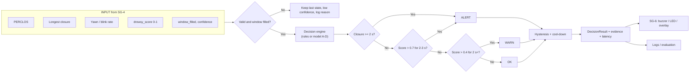

# SG-5 Decision Flow Map (Fahad Naseer)

Related: [[1 - Pipeline SG-1 to SG-5]] · [[3 - Process Flow Map]] · [[Driver Drowsiness Index]]

## Figma link
**FigJam board:** [SG-5 Drowsiness Decision Flow](https://www.figma.com/board/xjmE3awTLdKjKeff4Yvz1r?utm_source=claude&utm_content=edit_in_figjam&oai_id=&request_id=0bf6579f-cf5a-4fcb-a9d0-24ac93d17f83)

## What SG-5 does, in plain words
SG-5 is the final decision step. It receives a summary of the driver's behaviour over the last 30-60 seconds from SG-4 and answers one question: **is the driver OK, getting drowsy, or in danger?** It also says *why*.

## Input (from SG-4)
- **PERCLOS** - share of the window the eyes were closed
- **Longest closure** - the longest single eyes-shut period (seconds)
- **Yawn rate** and **blink rate** - per minute
- **drowsy_score** - one number from 0 (alert) to 1 (very drowsy)
- **window_filled / confidence** - is there enough data to trust the score

If there is no face or the system is still warming up, SG-5 keeps the last state, marks low confidence and logs the reason. It never crashes and always returns a decision.

## How the decision is made
1. One eye closure of about 2 s or more → **ALERT** immediately.
2. Score above about 0.7 for 2-3 s → **ALERT**.
3. Score above about 0.4 for 2 s or more → **WARN**.
4. Otherwise → **OK**.
5. **Hysteresis + cool-down:** the state only drops when the score is clearly lower, so the alarm does not flicker.

*The numbers are proposed starting values. Tune them on real test videos.*

## Possible models

| Option | Model | Pros | Cons |
|---|---|---|---|
| A (baseline) | Weighted score + thresholds (rule-based) | Fast on Jetson, explainable, no training data | Hand-tuned |
| B | Logistic regression on the 4 signals | Simple, still explainable | Needs labelled data |
| C | Gradient boosting / decision tree | Handles interactions between signals | More data, less transparent |
| D | Small LSTM / 1D CNN on signal history | Learns time patterns | Most data, heavier, hard to explain |

Options B-D replace only the score calculation and still output the same 0-1 score, so the interface contract does not change.

## Output (DecisionResult)
`state` (OK / WARN / ALERT), `alert` flag, `drowsy_score`, `evidence` sentence (e.g. "PERCLOS 0.42 > 0.30 for 3.1 s"), `latency_ms`. It goes to SG-6 (buzzer / LED / screen overlay) and to the logs for failure analysis.

## Flow map

