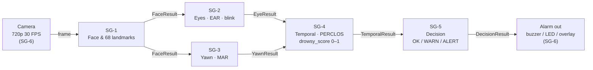
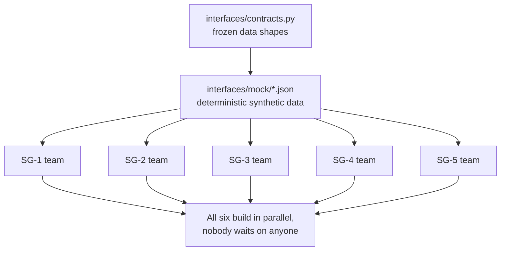
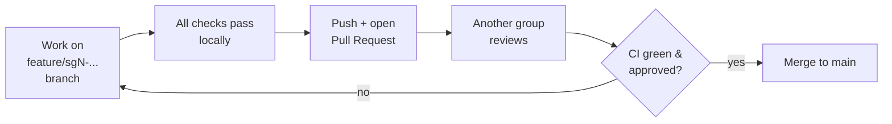

# Driver Drowsiness Monitoring System

A real-time computer-vision system that watches a driver through a camera and warns
them when they start to fall asleep.

---

## 1. What is this project?

A drowsy driver is dangerous: eyes close for a second too long, blinks get slow,
yawns pile up. This system watches the driver's face live through a camera and, the
moment those signs add up, it raises an alarm — a staged **OK → WARN → ALERT**
decision with an on-device buzzer/light.

**How we do it.** Everything runs in **Python with OpenCV**. The camera feeds frames
into a chain of small, specialised stages. One frame alone means nothing (people
blink and glance down all the time), so the system reasons about the *pattern over
time* — how long the eyes stay shut, how often, how much yawning — before it decides
anything. The final system runs on an **NVIDIA Jetson Orin Nano** (a small in-car
computer), at 720p and 30 frames per second.

**Algorithms we'll use (tentative — baselines first, then compared against alternatives):**

| Stage | Baseline algorithm | What it measures | Alternative we'll compare |
|---|---|---|---|
| Face & landmarks | **MediaPipe FaceMesh** | finds the face, 68 facial points | RetinaFace + PFLD |
| Eye state | **EAR** (Eye Aspect Ratio) | how open the eyes are, per frame | MobileNetV2 eye classifier (better with glasses/low light) |
| Yawn | **MAR** (Mouth Aspect Ratio) | how wide the mouth is open | MobileNet yawn classifier |
| Temporal | **PERCLOS + sliding window** | % of time eyes closed, blink/yawn rates | LSTM over frame cues |
| Decision | **Weighted score + hysteresis** | fuses evidence into a stable state | SVM / small MLP |
| Jetson speed-up | **TensorRT FP16** | runs the models fast on the device | — |

These are starting points. Each team implements the baseline first, then measures a
second approach and picks the winner with numbers — see
[`documentation/algorithm_selection.md`](documentation/algorithm_selection.md).

---

## 2. How we are building it

The system is a **pipeline**: the camera's frame flows left to right, each stage
adding information, until a decision comes out the end.



### We build in parallel, not one module after another

If we built the chain in order — finish SG-1, then SG-2, then SG-3… — everyone would
be stuck waiting for the person before them. We don't do that.

Instead we **freeze the interfaces first** (the exact shape of data each stage hands
to the next, in [`interfaces/contracts.py`](interfaces/contracts.py)) and generate
**mock data** for every stage. Then **all six teams build at the same time**, each
testing against the mock output of the stage before it — as if their neighbour were
already finished.



The mock data (`mock_face.json`, `mock_eye.json`, `mock_yawn.json`,
`mock_temporal.json`) is synthetic but geometrically honest — run the real EAR/MAR
maths on it and you get the expected curve. It's deterministic, so every teammate
gets byte-identical files and can compare results. Regenerate it any time with
`python interfaces/mock/generate_mocks.py`.

---

## 3. The modules (branches)

Six sub-groups, one folder each, one job each:

| Module | Folder | Job |
|---|---|---|
| **SG-1** | [`module_sg1/`](module_sg1/README.md) | Find the driver's face, output 68 landmarks + eye/mouth regions |
| **SG-2** | [`module_sg2/`](module_sg2/README.md) | Eyes open/closed, blinks, how long closed (EAR) |
| **SG-3** | [`module_sg3/`](module_sg3/README.md) | Yawn detection (MAR) |
| **SG-4** | [`module_sg4/`](module_sg4/README.md) | Combine cues over a time window → a drowsiness score |
| **SG-5** | [`module_sg5/`](module_sg5/README.md) | Turn the score into a stable OK / WARN / ALERT decision |
| **SG-6** | [`embedded_sg6/`](embedded_sg6/README.md) | Put it all on the Jetson: camera, alarm, speed profiling |

```
interfaces/   frozen data contracts + mock data   ← read this first
common/       shared helpers (config, timing, video, JSON)
module_sg1..5/ the five analysis modules
embedded_sg6/ Jetson deployment
integration/  the code that chains all five together + end-to-end tests
evaluation/   accuracy metrics on real clips
datasets/     manifests and download scripts only — never raw video
documentation/ roadmap, risks, algorithm notes
```

---

## 4. How to clone and set up

```bash
# Clone
git clone https://github.com/fahadnaseerhs/Driver-Drowsiness.git
cd Driver-Drowsiness

# Virtual environment
python -m venv .venv
.venv\Scripts\activate          # Windows
# source .venv/bin/activate     # Linux / macOS

# Install dependencies
pip install -r requirements-dev.txt
```

Check it works — this runs the whole system against the synthetic driver, no camera
or models needed:

```bash
python integration/run_pipeline.py --source mock --check-scenario
```

Expected:

```
frames            : 300
states            : OK 186  WARN 0  ALERT 114
contract violations: 0
scenario check    :
  PASS  alarm fired at 6.20s during the 1.80s closure starting 5.20s (lag 1.00s)
  PASS  no false alarm in the alert driver's first 2.0s
```

---

## 5. How to work on your module (and not break anyone else's)

**Golden rule: you only touch your own module's folder.** The contracts and mock data
are shared — they are everyone's, so you don't edit them alone.

| Path | Who may change it |
|---|---|
| `module_sg1/` … `module_sg5/` | that sub-group — your module, your call |
| `embedded_sg6/` | SG-6 (coordinate first) |
| `interfaces/contracts.py` | **the whole team** — frozen, needs agreement + a `SCHEMA_VERSION` bump |
| `interfaces/mock/` | the whole team — never hand-edit JSON; change `generate_mocks.py` and re-run |
| `integration/`, `common/` | shared — PR reviewed by another group |

**Work on a branch, never on `main` directly:**

```bash
git checkout main
git pull                                   # start from the latest
git checkout -b feature/sg2-ear-baseline   # your branch: feature/sgN-short-description
```

Develop and test *only* against mock input, so you never need another team's code to
be finished:

```bash
python module_sg2/run.py                   # runs your module alone on the mock input
python module_sg2/run.py --dump module_sg2/results/run01.json
pytest module_sg2/tests -q                 # your module's own tests
```

Because every module reads and writes the same contract objects, when the real
modules are ready they drop straight in where the mocks were — nothing downstream has
to change.

---

## 6. How to know your module is actually done

A module is **not** finished just because it runs on your machine. It's done when it
**speaks the contract correctly** and plugs into the pipeline. Before you call it
complete, all of these must pass:

```bash
ruff check .                                               # lint is clean
pytest -q                                                  # all tests pass
python module_sgN/run.py                                   # your module: 0 contract violations
python integration/run_pipeline.py --source mock --check-scenario   # you didn't break the chain
```

Definition of done for a module:

- [ ] `python module_sgN/run.py` reports **0 contract violations**
- [ ] Your module's tests pass (`pytest module_sgN/tests -q`)
- [ ] The full mock pipeline still passes — proof you didn't break a neighbour
- [ ] Your module handles bad input: upstream `valid=False` on a frame must **not** crash it (return your own `empty()` result with a reason)
- [ ] Your module README is updated: purpose, dependencies, how to run, and a **performance table** (accuracy / FPS / memory, and *on what hardware*)

A performance number without the hardware it was measured on doesn't count as a result.

---

## 7. How we merge to `main`

`main` is protected and always green. Nothing goes in except through a reviewed pull
request.



The three checks that **must** pass before you open a PR (the last one proves you
haven't broken anyone else's module):

```bash
ruff check .
pytest -q
python integration/run_pipeline.py --source mock --check-scenario
```

Rules:
- **One pull request per logical change.** A PR touching three modules is one nobody reviews properly.
- **Branch naming:** `feature/sgN-short-description` or `fix/sgN-...`.
- **Commit messages describe the technical change**, e.g. `SG-2: reject closures over 500 ms as blinks so microsleeps reach SG-4 as PERCLOS` — not "fixed bug".
- A PR that touches `interfaces/contracts.py` needs team agreement and regenerated mocks; CI flags it automatically.

Full working practice, PR template, and what never gets committed:
[`CONTRIBUTING.md`](CONTRIBUTING.md).

---

## Running the whole system

```bash
python integration/run_pipeline.py --source mock             # synthetic driver (no hardware)
python integration/run_pipeline.py --source datasets/samples/clip01.mp4   # a recorded clip
python integration/run_pipeline.py --source 0 --display      # live camera + debug overlay
```

On the Jetson, the same pipeline runs on-device from the camera — see
[`embedded_sg6/README.md`](embedded_sg6/README.md).
